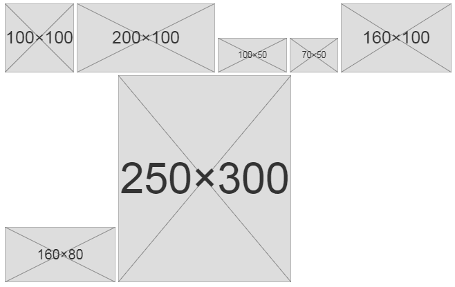

# Dummy images generator
This class allows you to easily generate dummy images on your HTML page. This
may be useful in web development during the layout creation.



## Usage
Write in HTML a set of images with `dummy` class name:
```html


<!-- You may assign only one attribute. Default will be used for other one: -->


<!-- Or without attributes at all: -->

```

Then, init the dummy images generator in JavaScript section:
```html
<script src="js/dummy-images.js"></script>
<script>
  // Dummy images will be generated only for sub-elements of `.test` element
  var images = new DummyImages(document.querySelector('.test'));
</script>
```

Or even easier:

```html
<script src="js/dummy-images.js"></script>
<script>
new DummyImages(); // Init dummy images generator for all images.
</script>
```

The second way is more convenient if you want to apply generator to all
of the body images.

## Parameters
Parameters are:

- Root element, which children images will be generated.
If this parameter is not set, `document.body` will be used.
- Class name, which will be used to detect dummy images.
- Default width of image (if `img` attribute is not set).
- Default height of image.

Use `null` to pass one of them.

```js
var el = document.querySelector('.my-container');
var className = 'my-class';
var minWidth = 160;
var minHeight = 100;

new DummyImages(el, className, minWidth, minHeight);
```
